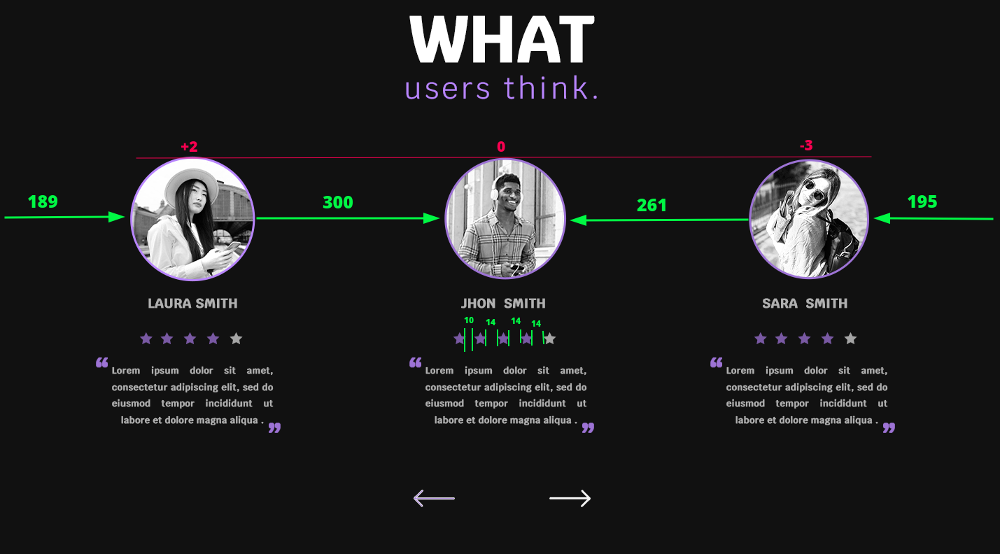
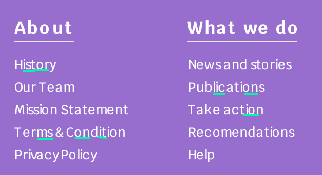
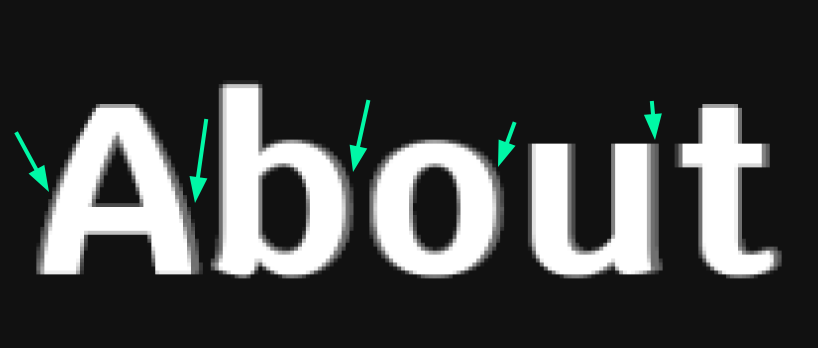

# **UI for beginners** Landing Page

You can check out our page [here](https://uid-bsuir.github.io/task1/).

The condition of not exceeding a value of 100px when using `margin`, `padding`, `top`, and `left` is typically achieved by using properties from the flex group. `Grid` was not used.

In some cases, the designer was inconsistent with margins and sizes, and whenever possible, the layout was still replicated accurately. However, in two instances, it was necessary to disregard the lack of uniformity and introduce it independently.

### Section 7

Specifically, this occurred in section 7, where some of the sizes are provided below.

It's evident that adhering strictly to all the sizes in this section wouldn't enhance code readability. Therefore, the decision was made to standardize the sizes, which, however, resulted in the layout appearing as follows when overlaid.

A different situation occurred in the footer, where the designer left inconsistent and technically challenging `letter-spacing` attribute.

### Footer

The decision was made to overlook this issue and align everything to the best of our ability. The overlay resulted in the following outcome.

There was also a suspicion that the typeface used by the designer slightly differed from the one with the same name available in the Google Fonts service. This suspicion arose because quite often, in cases where the font was at its maximum weight and with the same glyph height, the actual letter thickness differed from what was shown on the layout.

